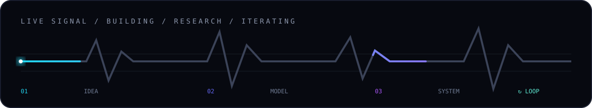

<div align="center">


</div>

<br />

<div align="center">

`DATA SCIENCE` &nbsp;×&nbsp; `AI/ML` &nbsp;×&nbsp; `SYSTEMS`

Building, learning and figuring things out.

</div>

<br />

---

## NOW

<table>
<tr>
<td width="50%">

### Research

Exploring data-driven questions around **time series, forecasting, economics and machine learning**.

</td>
<td width="50%">

### Building

Turning ideas into practical systems with **Python, AI/ML, APIs and automation**.

</td>
</tr>
<tr>
<td width="50%">

### Learning

Going deeper into **model development, software architecture and reliable AI systems**.

</td>
<td width="50%">

### Exploring

Always experimenting with new tools, workflows and ways to make things work better.

</td>
</tr>
</table>

---

## STACK

<div align="center">

`Python` · `PyTorch` · `YOLO` · `OpenCV` · `scikit-learn` · `FastAPI` · `React` · `SQL` · `Docker` · `Git` · `Linux` · `Pandas` · `NumPy` · `Statsmodels` · `Jupyter` · `Spark ML`

</div>

<br />

<div align="center">



</div>

---

## APPROACH

```text
              IDEAS
                │
                ▼
             EXPERIMENT
                │
                ▼
               DATA
                │
                ▼
              MODELS
                │
                ▼
             SYSTEMS
                │
                ▼
              ITERATE
                └───────────────↺
```

I like working across the whole path — from messy data and experiments to something people can actually use.

---

<div align="center">

### BUILDING THINGS THAT MATTER.

`●` ALWAYS EXPERIMENTING

<br /><br />

<a href="https://github.com/hhharrrshhh">GitHub</a>

</div>
